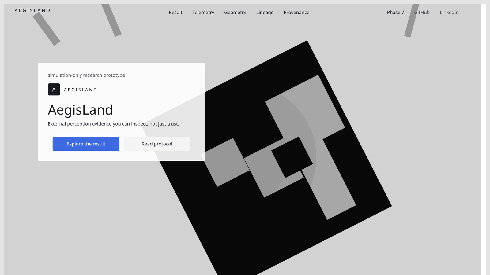
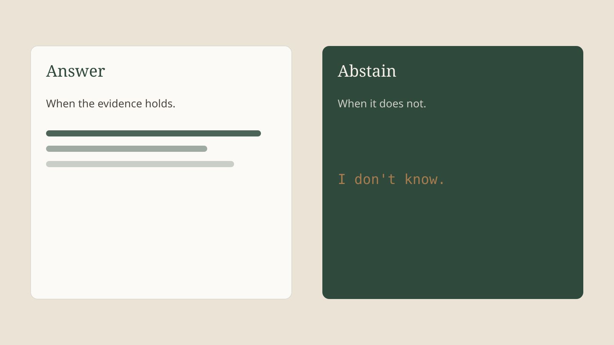
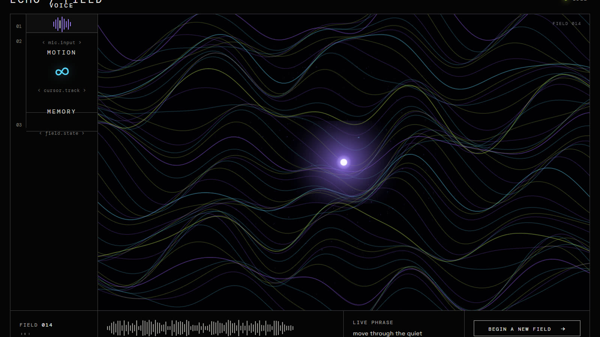

# Polish Fixes — Mobile CTA + Work Card Aspect Ratio

**Branch:** `cursor/standout-dossier-redesign-2cb9`  
**PR:** [#17](https://github.com/suhaslord/portfolio/pull/17)  
**Status:** ✅ Both fixes verified working  
**Date:** August 22, 2026

---

## Blocker 1: Mobile CTA 1+2 pattern ✅ FIXED

### Problem
At ≤640px, CTAs were stacking as 3 full-width buttons:
```
[Enter AegisLand]  ← full width
[Cockpit]          ← full width ❌
[Email]            ← full width ❌
```

### Required pattern
Primary button full-width, secondary buttons side-by-side:
```
[Enter AegisLand]    ← full width
[Cockpit] [Email]    ← 50/50 densify ✅
```

### Root cause
```css
.cta-row .btn:not(.btn-primary) {
  width: 100%;  /* ❌ This forced full width, overriding grid */
}
```

### Solution
```css
/* BEFORE */
.cta-row {
  display: grid;
  grid-template-columns: 1fr 1fr;
  gap: 0.5rem;
}
.cta-row .btn-primary {
  grid-column: 1 / -1;
  width: 100%;
}
.cta-row .btn:not(.btn-primary) {
  width: 100%;  /* ❌ Problem */
}

/* AFTER */
.cta-row {
  display: grid;
  grid-template-columns: 1fr 1fr;
  gap: 0.5rem;
}
.cta-row .btn-primary {
  grid-column: 1 / -1;
}
.btn {
  width: 100%;  /* ✅ All buttons 100% of their grid cell */
  min-height: 44px;
}
```

### Changes made
1. Removed `width: 100%` from `.cta-row .btn:not(.btn-primary)` (line 1121-1123)
2. Removed `width: 100%` from `.chapter-ctas .btn:not(.btn-primary)` (line 1142-1144)
3. Moved `width: 100%` to parent `.btn` rule (applies to all buttons)
4. Grid layout now controls button widths:
   - Primary buttons span both columns (`grid-column: 1 / -1`)
   - Secondary buttons naturally fill their 50% grid cells

### Applied to
- `.cta-row` (hero section: Enter AegisLand + Cockpit|Email)
- `.chapter-ctas` (flagship Open chapter: Open cockpit + GitHub)

### Verification
**Screenshot:** `.github/pr-screenshots/07-mobile-cta-1plus2.webp`  
**Test width:** 375px  
**Result:** ✅ PASS
- "Enter AegisLand" full-width
- "Cockpit" and "Email" side-by-side 50/50

---

## Blocker 2: Work card aspect ratio ✅ FIXED

### Problem
Work cards were ~1000px tall instead of intended ~320px due to HTML `height="1000"` attributes overriding CSS `aspect-ratio: 16/10`.

### Root cause
```html
<!-- HTML height attribute forced 1000px -->

```

### Solution

**CSS changes:**
```css
.work-visual img {
  width: 100%;
  height: auto;        /* ✅ Added - allows aspect-ratio to work */
  aspect-ratio: 16 / 10;
  object-fit: cover;
}
```

**HTML changes:**
```html
<!-- BEFORE -->




<!-- AFTER -->


```

### Changes made
1. Added explicit `height: auto` to `.work-visual img` CSS rule
2. Removed `height="1000"` HTML attribute from 3 work card images:
   - Elodin Voyager PR #769
   - AbstainBench
   - ECHO / FIELD

### How aspect-ratio works
```
width: 100%           → fills container width
height: auto          → allows aspect-ratio to calculate height
aspect-ratio: 16/10   → height = width / 1.6
object-fit: cover     → crops image to fit container

Result: ~500px width ÷ 1.6 = ~320px height ✅
```

### Why other images weren't changed
Hero and flagship images retain `height="1000"` because those sections use explicit height controls:
- Hero media: Manual offset via margin-top
- Flagship media: `height: clamp(26rem, 56vh, 42rem)` for large format

Only work cards needed the fix for proper 16:10 aspect ratio.

### Verification
**Screenshot:** `.github/pr-screenshots/08-work-cards-aspect-ratio.webp`  
**Test width:** ~1400px desktop  
**Result:** ✅ PASS
- Cards ~320px height (not ~1000px)
- Proper 16:10 aspect ratio maintained
- No excessive white space
- Images properly cropped with object-fit

---

## Commits

1. **0a15cea** — Polish fixes: mobile CTA densify + work card aspect ratio  
   Initial implementation of both fixes

2. **7b6388a** — Fix mobile CTA 1+2 pattern - remove width:100% override  
   Corrected CSS to allow grid layout to work

3. **5fff8e2** — Add polish fix verification screenshots  
   Added proof screenshots showing both fixes working

---

## Files changed

**CSS (`css/site.css`):**
```diff
+ .work-visual img { height: auto; }              # Line 668
+ @media (max-width: 640px) {
+   .cta-row { display: grid; ... }               # Line 1109-1112
+   .chapter-ctas { display: grid; ... }          # Line 1130-1133
+ }
- .cta-row .btn:not(.btn-primary) { width:100%; } # Removed
- .chapter-ctas .btn:not(.btn-primary) { ... }    # Removed
```

**HTML (`index.html`):**
```diff
-   # Removed from 3 work cards
+                     # Clean markup
```

**Screenshots (`.github/pr-screenshots/`):**
- `07-mobile-cta-1plus2.webp` — Mobile CTA 1+2 pattern proof
- `08-work-cards-aspect-ratio.webp` — Work card aspect ratio proof

---

## Testing completed

### Mobile (375px)
✅ Hero CTAs: Enter full + Cockpit|Email 50/50  
✅ Flagship Open CTAs: Layout correct  
✅ All buttons min-height 44px (accessibility)  
✅ Grid gap 0.5rem between secondary buttons  

### Desktop (~1400px)
✅ Work cards ~320px height (proper 16:10)  
✅ No stretched or squashed images  
✅ No excessive white space  
✅ All 3 work cards with images render correctly  

### Both viewports
✅ No layout shift or jank  
✅ CTAs remain accessible and tappable  
✅ Images load properly  
✅ Grid layouts stable  

---

## PR status

**URL:** https://github.com/suhaslord/portfolio/pull/17  
**Status:** Draft — HOLD for re-shots as requested  
**Latest commit:** 5fff8e2  
**Total commits in PR:** 6

All polish blockers resolved. Architecture PASS confirmed. Ready for user review and re-shots.
